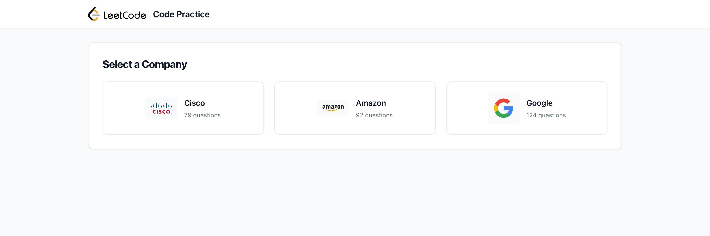
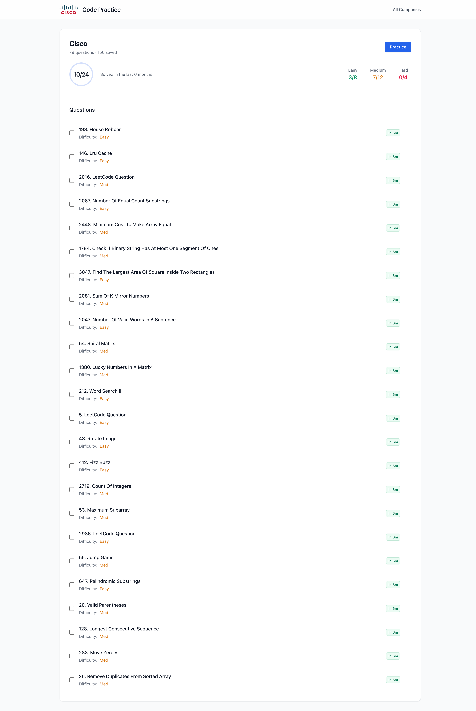

# LeetCode Practice List

A web application to help you track and practice LeetCode questions by company. Features include:

- 🏢 Browse questions by top tech companies (Cisco, ~~Amazon~~, ~~Google~~)
- ✅ Track your progress with a local storage todo list
- 📊 View difficulty distribution and completion stats
- 🔄 Auto-fetches question links via web crawler
- 📱 Responsive design that works on mobile and desktop

## Screenshots

## Features in Development

- [ ] Enhanced question difficulty indicators
- [ ] Question completion timing tracking
- [ ] Automatic question ID indexing and sorting
- [ ] More company integrations
- [ ] Progress analytics and insights
- [ ] Cloud sync capabilities

## Tech Stack

- HTML/CSS with UnoCSS for styling
- Vanilla JavaScript for interactivity
- Local Storage for data persistence
- DuckDuckGo web crawler for question links

## Getting Started

1. Clone the repository
2. Open index.html in your browser
3. Select a company to view their questions
4. Track your progress by checking off completed questions

Contributions and feature requests welcome!